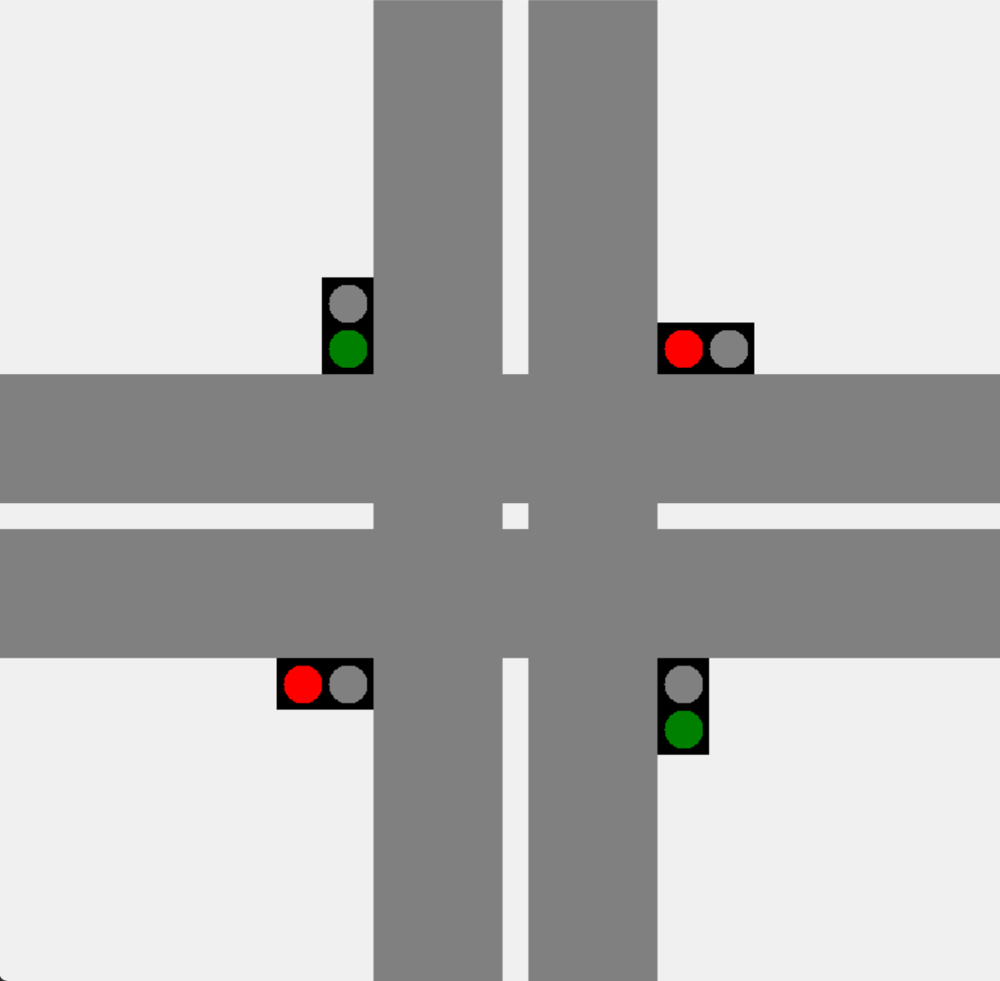
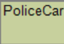
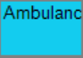
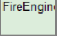
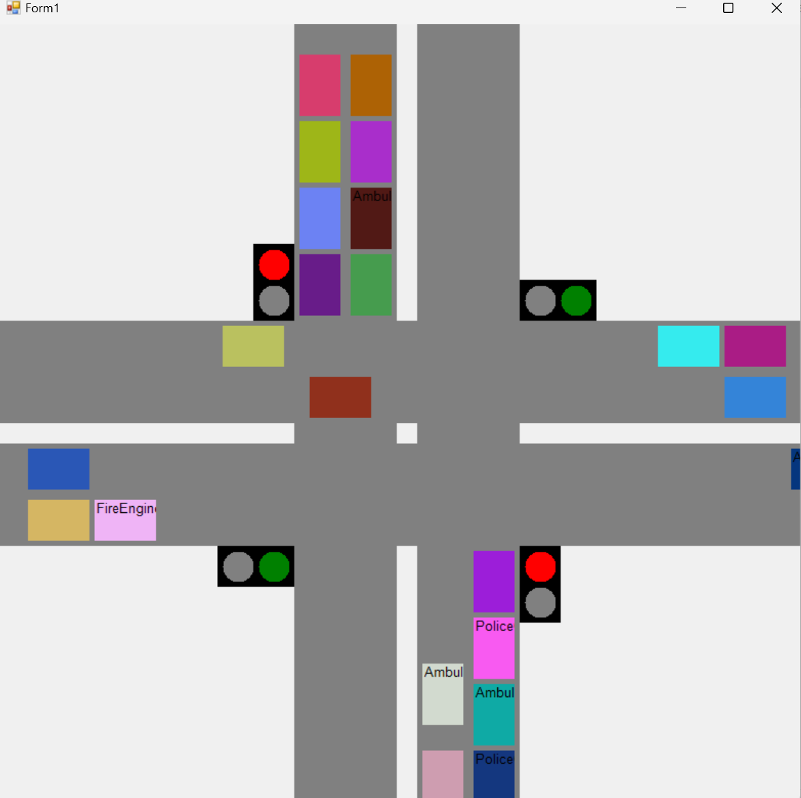

# Traffic2

2251548-韩敬霄

## 项目简介

本项目模拟了十字路口交通调度的过程。

### 项目目的

- 体会理解多线程概念，编写异步程序
- 掌握调度机制
- 熟悉任务间同步机制
- 理解信号量机制

### 项目功能

项目实现的功能如下：

- **交通信号灯的交替红绿显示**

	在东西南北四个方向设计了四栈红绿灯，其中东西方向同步，南北方向同步，间隔8秒交替。

- **普通车辆正常通行及等待**

	绿灯方向的车辆可以正常通行，而红灯方向的车辆需要等待。

- **特种车辆闯红灯的实现**

	红灯方向的特种车辆若前方没有普通车辆遮挡，则可以抢占路口资源，实现闯红灯的效果。

### 项目环境

- **开发环境**

	C#.NET Framework 4.7.2 Windows窗体应用程序

	Windows11操作系统

- **运行环境**

	请在Windows7及以上版本运行，于Windows11运行最佳

- **运行方法**

	打开Traffic2.exe即可运行本项目

## 功能实现

### 实体介绍

本项目主要分为三个实体：道路、交通信号灯和车辆

- **道路**（`Road`）类：

道路实体较为简单，在界面中心对称呈现四条道路，每个道路为两个车道。

- **交通信号灯**（`TrafficLightControl`）类

每个方向各有一个交通信号灯，分别可以呈现红绿两种颜色，其中南北方向的信号灯同步，东西方向取反。红色表示不可通行，绿色表示可以通行。每隔8秒颜色会交替。

- **车辆**（`CarBase`）类

车辆采用面向对象的方式设计，`CarBase`类为抽象基类，实现基本的方法；`Car`类和`SpecialCar`类继承自`CarBase`类，Car类为普通车辆，`SpecialCar`类为特种车辆；`PoliceCar`（警车）类，`Ambulance`（救护车）类，`FireEngine`（消防车）类继承自`SpecialCar`类。

| Car                                                          | PoliceCar                                                    | Ambulance                                                    | FireEngine                                                   |
| ------------------------------------------------------------ | ------------------------------------------------------------ | ------------------------------------------------------------ | ------------------------------------------------------------ |
|  |  |  |  |

对于车辆基类而言，他们将被赋予不同的随机颜色，有基本的行驶（`Drive`）方法，在执行行驶方法后将利用计时器模拟播放行驶动画。

### 系统介绍

- **交通信号灯系统**（`TrafficLightSystem`）类

	- 在初始化界面时构造一个实例，将包含四个方向交通信号灯实例，一个方向映射字典。

	- 利用计时器设定每8秒切换可通行方向。

- **车道**（`Lane`）类

	- 每个`Lane`的实例将包含一个车辆（`CarBase`）的队列，用于管理车辆。

	- 在初始化时利用`EnterLane`方法插入车辆实例。

	- 在该方向可通行时执行`ExitLane`方法，让车辆执行行驶动作，并退出队列。

- **车道系统**（`TrafficLaneSystem`）类

	- 在初始化界面时构造一个实例，将包含各个方向的`Lane`的实例，一个方向与车道的映射字典。

	- 初始化界面时将执行`PutCar`方法，将`Lane`实例中包含的车辆队列中车辆绘画到窗口的道路上，其中`CalculateCarPositions`方法将负责车辆的初始化位置。

	- 初始化界面之后该实例将循环插入四个方向的异步行驶任务（`DriveTask`方法）。

	- 在每个异步行驶任务中将利用`IsAbleToPass`方法当前方向的车道能否通行并在结果为True时执行车辆的行驶操作，否则将等待50毫秒以减少CPU负担。

- **Form1**类

	- `Form1`类包含一个`TrafficLightSystem`的实例和一个`TrafficLaneSystem`类的实例（实际这两个类可以被作为静态类，限于时间没有修改）以及两个方向的信号量（依据我个人的算法应该只需要一个信号量即可，限于时间没有修改）。

	- `Form1`类将呈现整个界面，并作为主线程分支其他线程。

	- 程序开始执行后，`Form1`类的构造函数首先执行界面初始化（`InitGUI`）方法，包括初始化`TrafficLightSystem`和`TrafficLaneSystem`实例，初始化显示交通信号灯，初始化道路；界面初始化完成后将插入四个方向的行驶任务，异步进行。

		

## 调度算法

通过信号量机制实现可通行方向的车辆与不可通行方向的特种车辆的竞争。

四个方向的线程将每间隔50毫秒检测该方向是否可通行，若可通行，则抢占路口资源（抢占信号量），并让该方向的车辆通行，然后将释放信号量，重新抢占。

### 算法可行性分析

1. 由于设计时车辆在开始行驶后便异步执行动画，而后就释放信号量，可能造成画面上的相撞，实际上应设计为已开始行驶的最后一辆车彻底经过路口后再释放信号量比较合适，而不是车辆开始行驶就释放信号量。同样的原因，这一点也会造成交通灯信号转换那一会的视觉上的相撞。
2. 利用时间延迟模拟特种车辆闯红灯时经过路口，避免相撞；但是由于每辆这样的闯红灯的特种车辆都需要延时，则会造成多辆需要闯红灯的特种车辆需要一一等待并发车，使得效果并不流畅。
3. 优化方向：由于时间原因，没有足够的时间修改上述提到的不足，如果项目继续进展可以考虑优化。其次可以引进更先进的调度算法，可以考虑预测或机器学习的算法。
4. UI改进：可以做出超车的UI动画而不是直接穿过前车。

## 心得体会

1. **面向对象编程**：在本次项目设计种我采用了面向对象的方法进行开发，比一般的面向过程的编程所写的代码具有更好的可读性和可维护性。
2. **算法复杂性**：我设计的调度算法相当简单，但是可以将理论课种学到的知识进行实际应用，我认为就满足了这个项目的目的了。
3. **异步编程**：往常的编程一般是单线程运行，本次写代码主动考虑异步多线程编程，写起来更加复杂，也锻炼了我写并发程序的能力。
4. **版本控制**：在本次代码过程中我采用了Github远程仓库来进行版本控制，以便在修改代码后出现错误不会调整时及时回滚到可运行的版本。Github地址如下：`https://github.com/Eurekahah/Traffic-OS.git`
5. **UI交互**：为了提高本次课程设计的可视性，采用了.NET Framework 中的`drawing`模块来构建画面，提高了可视化编程的能力。
6. **代码调试**：在代码编写的前期进行大量的单元测试，以确保后期的整合出错概率较低。